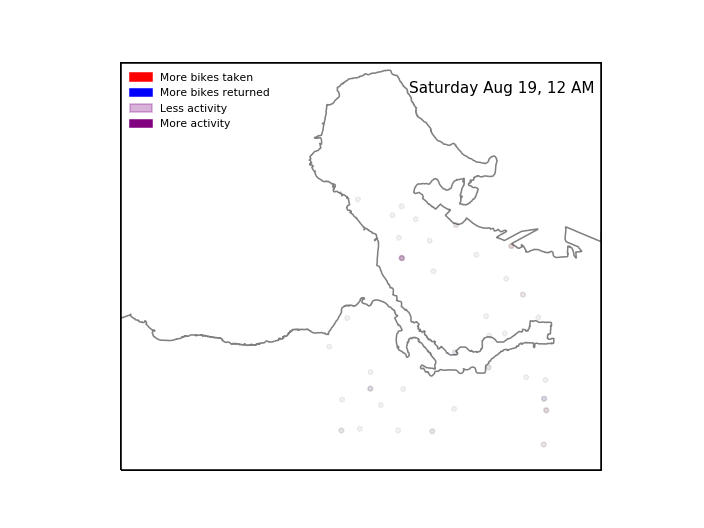

<html><body>
I finally got around to learning how to map data on to maps with Cartopy, so here's some quick maps of Mobi bikeshare station activity.

First, an animation of station activity during a random summer day. The red-blue spectrum represents whether more bikes were taken or returned at a given station, and the brightness represents total station activity during each hour. I could take the time resolution lower than an hour, but I doubt the data is very meaningful at that level.

 

<!--more-->

 

There's actually less pattern to this than I expected. I thought that in the morning you'd see more bikes being taken from the west end and south False Creek and returned downtown, and vice versa in the afternoon. But I can't really make out that pattern visually.

I've also pulled out total station activity during the time I've been collecting this data, June through October 2017. I've separated it by total bikes taken and total bikes returned. A couple things to note about these images: many of these stations were not active for the whole time period, and some stations have been moved around. I've made no effort to account for this; this is simply the raw usage at each location, so the downtown

The similarity in these maps is striking. Checking the raw data, I'm seeing incredibly similar numbers of bikes being taken and returned at each station. This either means that on aggregate people use Mobis for two way trips much more often than I expected; one way trips are cancelling each other out; or Mobi is rebalancing the stations to a degree that any unevenness is being masked out*. I hope to look more into whether I can spot artificial station balancing from my data soon, but we may have to wait for official data from Mobi to get around this.

<em>\*There's also the possibility that my data is bad, but let's ignore that for now</em>

Instead of just looking at activity, I tried to quantify whether there are different activity patterns at different stations. Like <a href="http://mikejarrett.ca/blog/2017/10/machine-learning-with-vancouver-bike-share-data/">last week</a>, I performed a primary component analysis (PCA) but with bike activity each hour in the columns, and each station as a row. I then plot the top two components which most explain the variance in the data.

Like last week, much of the difference in station activity is explained by the total number of trips at each station, here represented on the X axis. There is a single main group of stations with a negative slope, but some outliers that are worth looking at. There are a few stations with higher Y values than expected.

These 5 stations are all Stanley Park stations. There's another four stations that might be slight outliers.

These are Anderson &amp; 2nd (Granville Island); Aquatic Centre; Coal Harbour Community Centre; and  Davie &amp; Beach. All seawall stations at major destinations. So all the outlier stations are stations that we wouldn't expect to show regular commuter patterns, but more tourist-style activity.

I was hoping to see different clusters to represent residential area stations vs employment area stations, but these don't show up. Not terribly surprising since the Mobi stations cover an area of the city where there is fairly dense residential development almost everywhere. This fits with our maps of station activity, where we saw that there were no major difference between bikes taken and bikes returned at each station.

<em>All the source code used for data acquisition and analysis in this post is available on my <a href="https://github.com/mjarrett/mobi">github page</a>.</em>

<em>To see more posts like this, follow me on twitter <a href="https://twitter.com/mikejarrett_">@bmikejarrett_</a>.</em>
</body></html>
